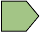
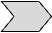
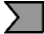
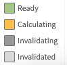
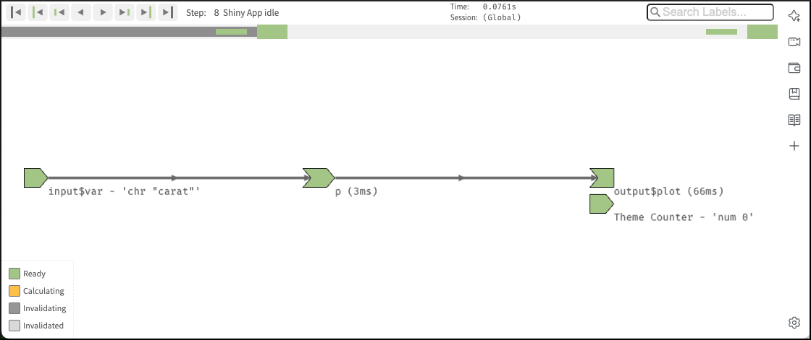
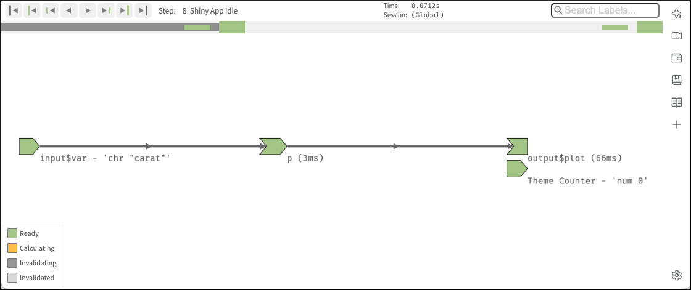
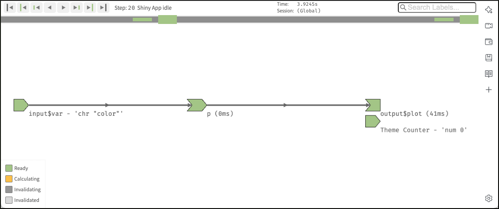

# The reactive graph {#sec-chap14}

## Introduction

```{r}
#| label: setup
#| results: hold
#| include: false

base::source(file = "R/helper.R")
library(glossary)
glossary::glossary_path("../glossary-pb/glossary.yml")
```

:::::: {#obj-chap14}
::::: my-objectives
::: my-objectives-header
Objectives and chapter section list
:::

::: my-objectives-container
The main objective of this chapter is to understand more fully and in
depth the reactive graph.

-   Understanding the reactive graph
-   Importance of invalidation
-   Using the {**reactlog**} package
:::
:::::
::::::

## A step-by-step tour of reactive execution

### Using a real app

Instead of the imaginary demo app from the book I will start my own tour on reactive execution with a much simpler but very useful app. Using the diamonds dataset of {**ggplot2**} we'll explore the data with bar charts of the different variables in the dataset.

::: {#imp-14-my-own-reactlog-tour .callout-important}
###### My own reactlog tour

Using a different app than in the book results in a different `reactlog` tour and structure of this chapter. The book uses a nonsensical app claiming that the underlying real app is not important for the understanding. The following step-by-step tour explains the different app states with the modelling of artificially created abstracts graphics. Only at the end of the chapter is a short section introducing the {**reactlog**} package.

In contrast to this approach I believe that a real life example in a real live environment is important. Therefore I will reverse the approach: My central focus is to understand the `reactlog` of a real app using the {**reactlog**} package. Instead of abstract graphics I will interact with the app and display the resulting `reactlog` via screenshots of the different steps[^14-reactive-graph-1].
:::

[^14-reactive-graph-1]: I am using the term `reactlog` in two different ways:
    {**reactlog**} references the package and `reactlog` or just
    reactlog without any emphasis is the result, which shows how the
    reactive graph evolves over time.

:::{.column-page-inset}

:::::{.my-r-code}
:::{.my-r-code-header}
:::::: {#cnj-14-hello-shiny-ggplot2}
: Exploring `diamonds` data with bar charts
::::::
:::
::::{.my-r-code-container}

::: {#lst-14-hello-shiny-ggplot2}

```{shinylive-r}
#| standalone: true
#| viewerHeight: 560
#| components: [editor, viewer]

## file: app.R

```

Exploring `diamonds` data with bar charts
:::

::::
:::::

:::

Let me comment some details of the app:

- With the exception of shiny functions, I have used as always the `<package-name>::` convention instead of the `library()` function. This is helpful for me to understand and remember the package origin of the function.
- I have set the theme from the gray background standard to a white background. This is not relevant for the functioning of the app but results in my opinion to a better visible output.
- As the variable (`carat`) is stored inside another variable (`input$var`), I have solved --- following @sec-chap12 --- the indirection problem in the data-masking function with `ggplot2::aes(.data[[input$var]])`.

### Preparing for the `reactlog`

Drawing the reactive graph by hand is a powerful technique to help you understand simple apps and build up an accurate mental model of reactive programming. But it’s painful to do for real apps that have many moving parts. Wouldn’t it be great if we could automatically draw the graph using what Shiny knows about it? This is the job of the {**reactlog**} package, which generates the so called `reactlog` which shows how the reactive graph evolves over time.

:::::{.my-procedure}
:::{.my-procedure-header}
:::::: {#prp-14-using-reactlog-package}
: Using the {**reactlog**} package
::::::
:::
::::{.my-procedure-container}

(@) Install the {**reactlog**} package
(@) Turn logging with `reactlog::reactlog_enable()` on. (But to enable `reactlog`, you could also set `options(shiny.reactlog = TRUE)` before running the application. But I prefer the first option which is recommended in the newer documentations.)
(@) Start the app.

From here you have two options:

(@) **Live inspection during runtime**: While the app is running, [press
     (or  on Windows)]{.mark}, to show the
    `reactlog` generated up to that point. You can interact with the app and (after refreshing your browser) inspect live the resulting status changes of the app. (**Important**: Calling the `reactlog` only works after you have interacted at least once with the app. Otherwise the keyboard shortcut will not open your default browser with a new tab and generate the `reactlog`.)
(@) **Post mortem analysis**: After the app is closed you can inspect the full `reactlog` graph for all sessions with `shiny::reactlogShow()`. The function opens a static HTML in your default browser. In this case, refreshing your browser will not load new activity into the report; you will need to call `shiny::reactlogShow()` explicitly.

::::
:::::

In @lst-14-hello-reactlog-ggplot2 contains the same R code as in @lst-14-hello-shiny-ggplot2 with the important addition of `reactlog::reactlog_enable()` to turn on reactive logging. Note that `reactlog::reactlog_enable()` is one of the few (in total eight) functions of the {**reactlog**} package. Most of the commands to control the `reactlog` are Shiny functions. 

:::{.column-page-inset}

:::::{.my-r-code}
:::{.my-r-code-header}
:::::: {#cnj-14-hello-reactlog-ggplot2}
: Turning on reactive logging for the `diamonds` exploring app
::::::
:::
::::{.my-r-code-container}
::: {#lst-14-hello-reactlog-ggplot2}

```{shinylive-r}
#| standalone: true
#| viewerHeight: 570
#| components: [editor, viewer]

## file: app.R

```

Turning on reactive logging for the `diamonds` exploring app
:::

::::
:::::

:::

### Setting up the `reactlog` environment

What follows are all the shiny steps that are done immediately after startup of our `diamonds` exploration app. I will stop the app instantly after startup and call `shiny::reactlogShow()` (because the keyboard shortcut for live inspections does not work at this stage). So there was no interaction with the app besides starting and closing.

::: {.callout-note #nte-14-difference-reactlog-and-drawing-by-hand}
###### Differences between reactlog graphics and drawings y hand

Between the hand made graphics in [chapter 14 of Mastering Shiny](https://mastering-shiny.org/reactive-graph.html) or in the [Shiny Reactlog article](https://rstudio.github.io/reactlog/articles/reactlog.html) and the `reactlog` there are several differences to note. Although `reactlog` uses the same graphical conventions as the mentioned text references, there are nonetheless some important distinctions:

1. The biggest difference is that `reactlog` draws every dependency, even if it’s not currently used, in order to keep the automated layout stable. Connections that are not currently active (but were in the past or will be in the future) are drawn as thin dotted lines. Therefore there are not only dotted lines but also dark and light gray objects. Dark gray means that the reactives are in the process of invalidating, whereas light gray denotes they are already invalidated.
2. Another important difference is that `reactlog` shows also three additional reactive inputs (`clientData$output_x_height`, `clientData$output_x_width`, and `clientData$pixelratio`) that don’t appear in the source code. These additional reactive inputs exist because plots have an implicit dependency on the size of the output; whenever the output changes size the plot needs be redrawn. This addition is annoying because it makes the `reactlog` much more complex that without it. For instance the startup procedure without these additional inputs would be five instead of 18, and after one interaction 44 instead of 12 steps!
3. In the `reactlog` there is also with `Theme Counter` another reactive input. The documentation about this addition is sparse. But I found finally out that it is created by the `reactlog::reactlog_enable()` function. It is a `reactiveVal()` that is used to track changes in the current theme of a Shiny session when (the not documented) `shiny::setCurrentTheme()` function is called[^14-reactive-graph-2]. This counter helps in managing dependencies related to Shiny's `r glossary("Bootstrap")` theme changes within the reactive graph of a Shiny application. From a [StackOverflow answer](https://stackoverflow.com/a/71827950/7322615) I learned that this function does [three things](https://github.com/rstudio/shiny/blob/fd7518018cbb2ec0b89960c922e34576d5dbc1e7/R/shiny.R#L1345): (1) It sets theme as the current bootstrap theme, (2) re-executes any registered theme dependencies, and (3) sends the resulting dependencies to the client.
4. Another difference is that in the standard mode the `reactlog` shows also the time it takes for calculating the output.
:::

[^14-reactive-graph-2]: There is for Shiny developers the function `shiny::getCurrentTheme()` to create Shiny bindings with intelligent styling based on the `shiny::bootstrapLib()`'s theme value.


{#fig-14-hello-reactlog-ggplot2 
fig-alt="alt-text" fig-align="center" 
width="100%"}


#### What do the different symbols mean? {#sec-14-meaning-reactive-symbols}

- The objects of the left side represent reactive inputs or reactive values. For example this here
\ is a ready input.
- The object(s) in the middle of the `reactlog` designate reactive expression. For example this here \ is an invalidated reactive expression. 
- The objects on the right hand side are (with the exception of the `Theme counter`) outputs or observers. Anywhere you see
"output", you can also think "observer." The primary difference is that
certain outputs that aren't visible will never be computed. We'll
discuss the details in @sec-15-observers-and-outputs. For example this here \  is an output or observer just in the process of invalidating.

The lines between the shapes are directional, with the arrows indicating the direction of their inter-dependencies. When a shiny app is loaded, the graph in @fig-14-hello-reactlog-ggplot2 has to be discovered and formed. Because of the additional three plot reactives (height, width and ratio) Shiny need 21 steps to find and rebuild all the elements of the app. 

Recall that reactive inputs and expressions are collectively called
`r glossary("reactive producers")`; reactive expressions and outputs are
`r glossary("reactive consumers")`.

The covered the colors in the examples above of the `reactlog` objects lack one additional color: Orange means that the object is just in the process of calculating a new value.

{#fig-14-reactlog-color-legend 
fig-alt="alt-text" fig-align="center" 
width="15%"}

What you see in @fig-14-hello-reactlog-ggplot2 is step 21 reached after the startup of the `diamonds` exploring app. The `reactlog` is always starting  with the first idle state after the startup. If you interact with the app extensively and type the keyboard F3 shortcut, then Shiny opens the default browser window displaying the first idle state of the startup, independently how many interactions and idle states you have had.

#### Labelling reactive expressions and observers

Note that while reactive inputs and outputs have names, reactive expressions and observers do not, so they’re labelled with their contents. In this case it is not important because the reactive has a short name and there are not many objects sharing the screen space. But reactives can be long strings abridged by `reactlog` and/or interfering with other `reactlog` objects. To make things easier to read (and understand) you may want use the `label` argument to `reactive()` and `observe()`, which will then appear in the `reactlog`. You can use `r glossary("emoji")`s to make particularly important reactives stand out visually.

The label argument works only with `reactive()` or `observe()`. I have therefore our hello-reactlog app so constructed that it has one reactive expression. This wouldn't be necessary for this simple app, because all computation could be done in `renderPlot()` output.

:::{.column-page-inset}

:::::{.my-r-code}
:::{.my-r-code-header}
:::::: {#cnj-14-hello-reactlog-ggplot2-emoji}
: Demonstrating how to highlight reactives using name and emoji in their `label` argument
::::::
:::
::::{.my-r-code-container}
::: {#lst-14-hello-reactlog-ggplot2-emoji}

```{shinylive-r}
#| standalone: true
#| viewerHeight: 550
#| components: [editor, viewer]

## file: app.R

```

Demonstrating how to use the `label` argument to highlight a reactive by name and emoji
:::

::::
:::::

:::

{#fig-14-hello-reactlog-ggplot2-emoji
fig-alt="alt-text" fig-align="center" 
width="100%"}

By pure change I learned that plotting the `diamonds` bar charts with the {**plotly**} package prevents the annoying complexity with the three reactives. I do not understand why there are no plot objects reactives with Plotly. Probably it has to do with the different {**plotly**) functions used instead of the original Shiny functions:

- `plotly::plotlyOutput()` instead of `shiny::plotOutput()`,
- `plotly::renderPlotly()` instead of `shiny::renderPlot()` and
- `plotly::plot_ly()` instead of several {**gplot2**} function. 

:::::{.my-resource}
:::{.my-resource-header}
:::::: {#lem-14-plotly-resources}
: Plotly resources
::::::
:::
::::{.my-resource-container}

- [Online book](https://plotly-r.com/): Interactive web-based data visualization with R, plotly, and shiny (especially chapter 2).
- [Online Tutorials](https://plotly.com/r/getting-started/): Getting Started with Plotly in R
- [Graphic Library](https://plotly.com/r/): Plotly R Open Source Graphing Library
- [My notes](https://bookdown.org/pbaumgartner/learning-plotly/): Learning Plotly (especially chapter 2).

::::
:::::

~~Unfortunately I can't remember where~~ I found the code of @lst-14-hello-reactlog-plotly in [Hello Reactlog](https://rstudio.github.io/reactlog/articles/reactlog.html#reactlog). This demo real functional demo app is a good occasion to learn about the working of Shiny apps without disturbing and irrelevant steps in the `reactlog`. I changed the code found in "Hello Reactlog" in two ways:

- I created a reactive function where all the computation is done whereas `renderPlotly()` only prints the resulting bar charts.
- I added `type = "histogram"`to the `plotly::plot_ly()` function to prevent the following annoying message:

> No trace type specified:
  Based on info supplied, a 'histogram' trace seems appropriate.
  Read more about this trace type -> https://plotly.com/r/reference/#histogram
  
:::{.column-page-inset}

:::::{.my-r-code}
:::{.my-r-code-header}
:::::: {#cnj-14-hello-reactlog-plotly}
: Using {**plotly**} to prevent irrelevant plot objects reactives  
::::::
:::
::::{.my-r-code-container}
::: {#lst-14-hello-reactlog-plotly}

```{shinylive-r}
#| standalone: true
#| viewerHeight: 550
#| components: [editor, viewer]

## file: app.R

```

Realizing the same app with {**plotly**} allowing interactivity with the plots and at te same time preventing the three plot resizing reactives
:::

::::
:::::

:::

::: {.callout-cuation #cau-14-package-version-mismatch}
###### Package version mismatch with the `r glossary("WebAssembly")` version of `shinylive-r` for {plotly}

I got the following warning message:

> Package version mismatch for plotly, ensure the versions below are compatible.   
> ℹ Installed version: 4.11.0, WebAssembly version: 4.10.4.     
> ℹ Install a package version matching the WebAssembly version to silence this
  error.
  
But fortunately it seems that {**plotly**} is working, even if there is a version mismatch.
:::

When a user interacts with the app and changes reactive input values, the graph is partially deconstructed and then reformed. The `reactlog` visualization is designed to help you inspect each particular step in this reactive life cycle. The sub-sections that follow explain how this reactive life cycle works in detail. 

For the following analysis I set the reactlog up with three steps:

- I start the @cnj-14-hello-reactlog-plotly app. After startup has finished the app has drawn the bar chart with the variable `carat`.
- I choose variable `cut` for another bar chart. And the app shows me the correspodning bar chart.
- Finally I pressed . The program changes from RStudio to my default browser Brave and displays the reactlog.
 


## Analyzing the `reactlog`

### A first look at the `reactlog`

As I said before the `reactlog` displays its first idle state after startup. This is for our app the step number eight.

{#fig-14-first-idle-state-plotly
fig-alt="alt-text" fig-align="center" 
width="100%"}

There are several steps before and after our starting point. This is the right time to make yourself familiar with the handling of the reactlog visualization through reading [Reactlog in detail](https://rstudio.github.io/reactlog/articles/reactlog.html#reactlog-in-detail). It has documented all the navigation elements and much more. Many nice feature of the `reactlog` are hidden and can be assesses only via keyboard shortcuts. The article explains

- the **status bar** with all its elements 
  - the [progress bar](https://rstudio.github.io/reactlog/articles/reactlog.html#progress-bar), 
  - the information displayed during the [current step](https://rstudio.github.io/reactlog/articles/reactlog.html#current-step), 
  - the [navigation buttons](https://rstudio.github.io/reactlog/articles/reactlog.html#navigation-buttons), 
  - the [search bar](https://rstudio.github.io/reactlog/articles/reactlog.html#search-bar) and
- the handling of the **dependency graph** with
  - the possible [reactive states](https://rstudio.github.io/reactlog/articles/reactlog.html#reactive-states) of the objects or nodes, reflected by their colors, 
  - the [highlighting and filtering](https://rstudio.github.io/reactlog/articles/reactlog.html#highlighting-and-filtering),
  - the [zooming](https://rstudio.github.io/reactlog/articles/reactlog.html#zooming)
  - the [labeling of the nodes](https://rstudio.github.io/reactlog/articles/reactlog.html#labeling-nodes)
  
Under the section [Hello Reactlog](https://rstudio.github.io/reactlog/articles/reactlog.html#reactlog) you will find a video with exactly the same steps I am going to explain in the following sub-sections. To get an overview what I am going to explain or to see the context of the individual steps explained below I have included the video here:



The video starts with the `carat` bar chart followed by the `color` bar charts. Around second four the user hit the  shortcut to get the `reactlog` view. I will take the information in [The reactive cycle](https://rstudio.github.io/reactlog/articles/reactlog.html#reactivity) section and adapt it to our real world app about exploring the `diamonds` dataset using {**plotly**}.

### A session begins

When you load a shiny app, all reactive expression and observers begin in an **invalidated** state (indicated in gray). Invalidated state essentially means that any code that the node depends upon needs to be re-executed.

{#fig-14-reactlog-01
fig-alt="alt-text" fig-align="center" 
width="100%"}

### Execution begins

After initializing a session, Shiny picks an observer (*not* a reactive expression) and starts executing it. `Reactlog` uses an orange fill to indicate when a node is actively executing (i.e., calculating).

You may wonder how Shiny decides which of the several invalidated observers/outputs to execute. The short answer is that you should act as if it’s random. Ideally, your observers and especially outputs won’t care what order they execute in, as each will function independently from the others. However, if you do have observers whose side effects must always happen in a certain relative order, you can use the observe function’s `priority` argument to dictate that order for observers. You can also control the priority of outputs by calling the `outputOptions()` function with a `priority` argument.

{#fig-14-reactlog-02
fig-alt="alt-text" fig-align="center" 
width="100%"}

### Detecting dependency

During an observer’s execution, it looks for it's dependencies which one or more reactive expressions. As soon as the dependency has detected, the observer becomes dependent on the reactive expression, represented below by the new arrow.

{#fig-14-reactlog-03
fig-alt="alt-text" fig-align="center" 
width="100%"}

### Reading a reactive expression

Remember that all reactive expressions start out in invalidated state (represented by the gray fill), including the one this observer is now trying to access. In order to return a value, the reactive expression needs to execute its code, which it starts doing now. The reactive expression is filled with orange to represent that it’s running.

Note that the observer is still orange: just because the reactive expression is now running, doesn’t mean that the observer has finished. The observer is waiting on the reactive expression to return its value so its own execution can continue, just like a regular function call in R.

{#fig-14-reactlog-04
fig-alt="alt-text" fig-align="center" 
width="100%"}

### Reading an input

This particular reactive expression happens to read a reactive input. Therefore, the reactive expression depends on the input, represented below by the arrow.

Unlike reactive expressions and observers, reactive inputs simply hold a value, so they don’t require an execution phase (i.e., their value is ready from the start). Therefore the fill with green immediately.

{#fig-14-reactlog-05
fig-alt="alt-text" fig-align="center" 
width="100%"}

### Reactive expression completes

In more complex apps, the reactive expression reads another reactive expression, which in turn reads another input. Those steps are not of interest any more since they’re just a repeat of what we’ve already described. Therefore we have chosen a more simple app so we could continue with the next new and interesting steps.

When the reactive expression has completed executing, it saves (caches) the resulting value internally before returning it to the observer that requested it. Now that the reactive expression has finished executing, it’s no longer in invalidated (gray) or running (orange) state; rather, it’s in idle/ready (green) state. When a reactive expression reaches this state, it means it’s up-to-date and will not re-execute its code even if other reactive expressions or observers request its value. Instead, it can instantly return the value it cached during its most recent execution.

{#fig-14-reactlog-06
fig-alt="alt-text" fig-align="center" 
width="100%"}

### Observer completes

Now that the reactive expression has returned its value to the observer, the observer can complete executing its code. When this has completed, it too enters the idle state, so its fill color will change to green.

{#fig-14-reactlog-07
fig-alt="alt-text" fig-align="center" 
width="100%"}

### Repeated cycle

After Shiny has completed execution of the first observer, it chooses in a more complex app as ours a second one to execute. Again, it turns orange, and may read values from reactive expressions, which will turn orange, and so on. This cycle will repeat until every invalidated observer enters the idle/ready (green) state.

### Execution completes, outputs flushed

At last, all of the observers have finished execution and are now idle. This round of reactive execution is complete, and nothing will happen with this session until some external force acts on the system (e.g. the user of the Shiny app choosing another variable in the user interface). In reactive terms, this session is now at rest.

{#fig-14-reactlog-08
fig-alt="alt-text" fig-align="center" 
width="100%"}

### Generalizing for more complex apps

Let’s stop here for just a moment and think about what would have happened with a more complex app. In that case we would read more than one inputs, calculated some values, and generated some outputs. But more importantly, in the course of doing that work, we also have discovered the **relationships** between these different calculations and outputs. An arrow from a reactive input to a reactive expression tells us that if the reactive input’s value changes, the reactive expression’s result value can no longer be considered valid. And an arrow from a reactive expression to an output means that if the reactive expression’s result is no longer valid, then the output’s previous result needs to be refreshed.

Just as important: In a more complex app we would also know which nodes are **not** dependent on each other. If no path exists from a particular reactive input to a particular output (always traveling in the direction that the arrows are pointing), then a change to that input couldn’t possibly have an effect on that output. That gives us the ability to state with confidence that we don’t need to refresh that output when that input changes, which is great – the less work we need to do, the sooner we can get results back to the user.

### An input changes

Step 8 left off with our Shiny session in a fully idle state. Now remember that we have selected in the application another variable for the bar chart. This causes the browser to send a message to their server, instructing Shiny to update the corresponding reactive input.

When a reactive input or value is modified, it kicks off an **invalidation phase**, which we haven’t seen up to this point. The invalidation phase starts at the changed input/value, which will be filled with dark gray, the color for starting the invalidation.

{#fig-14-reactlog-09
fig-alt="alt-text" fig-align="center" 
width="100%"}

### Notifying dependents

Now, we follow the arrows that we drew earlier. Each reactive expression and observer that we come across is put into invalidated state, then we continue following the arrows out of that node. As a refresher, for observers, the invalidated state means “should be executed as soon as Shiny gets a chance”, and for reactive expressions, it means “must execute the next time its value is requested”.

In this diagram, the arrows in the lighter shade indicate the paths we took from the changed reactive input through the reactive graph. Note that we can only traverse the arrows in their indicated direction; it’s impossible to move from a reactive expression leftwards to a reactive input, for example.

The procedure just described needs several intermediate steps corresposning to the complexity of the app. Here we have just two steps:

#### Invalidating reactive expression `p`


{#fig-14-reactlog-10
fig-alt="alt-text" fig-align="center" 
width="100%"}


#### Invalidating `output$plot`

{#fig-14-reactlog-11
fig-alt="alt-text" fig-align="center" 
width="100%"}

### Removing relationships

Next, each invalidated reactive expression and observer “erases” all of the arrows coming in or out of it. You can think of each arrow as a one-shot notification that will fire the next time a value changes. Not every time, just the next time. So all of the arrows coming out of a reactive expression are safe to erase; like a used bottle rocket, they’ve fired their one shot.

It may seem perverse that we put so much value on those relationships, and now we’re going out of our way to erase them! But the truth is, though these particular arrows **were** important, they are now themselves out of date. The only way to ensure that our graph stays accurate is to erase arrows when they become stale, and let Shiny rediscover the relationships around these nodes as they re-execute.

This marks the end of the invalidation phase.

In the hand drawings all relationships are removed, but in the `reactlog` the arrows change their color from dark to light gray and also become thinner. Again this procedure requires some intermediate steps in more complex apps. Here we have only two steps to clear all invalidated relations.

#### `output$plot` removes dependency on `p`

{#fig-14-reactlog-12
fig-alt="alt-text" fig-align="center" 
width="100%"}

#### `p` removes dependency on `input$var`

{#fig-14-reactlog-13
fig-alt="alt-text" fig-align="center" 
width="100%"}

### Re-execution

Now we’re in a pretty similar situation to when the Shiny session first started; we have some invalidated reactive expressions and outputs, and we don’t have any arrows coming in or out of them. It’s time to do exactly what we did then: execute the invalidated outputs/observers, one at a time.

What’s different this time, though, is that --- in a more complex app --- not all of the reactive expressions and outputs are starting out in the invalidated state. Some parts of the graph weren’t affected (neither directly nor indirectly) by the reactive input that had changed. That’s great, as we won’t need to re-execute those parts of the graph, even if they are used again by some of the invalidated parts!

For all the necessary intermediate steps I will just mention the step description in the `reactlog`.

#### `output$plot` started (again) calculating


{#fig-14-reactlog-14
fig-alt="alt-text" fig-align="center" 
width="100%"}

#### output$plot depeneds (again) on `p`

{#fig-14-reactlog-15
fig-alt="alt-text" fig-align="center" 
width="100%"}

#### `p`started (again) calculating

{#fig-14-reactlog-16
fig-alt="alt-text" fig-align="center" 
width="100%"}

#### `p` depends (again) on `input$var`

{#fig-14-reactlog-17
fig-alt="alt-text" fig-align="center" 
width="100%"}

#### `p` stopped caclulating

When the calculation process is finished the nodes chance it colors to green.

{#fig-14-reactlog-18
fig-alt="alt-text" fig-align="center" 
width="100%"}

#### `outplut$plot` stopped calculating

{#fig-14-reactlog-19
fig-alt="alt-text" fig-align="center" 
width="100%"}

## Shiny app in idle state (again)

We have finished the recalculation. All nodes are ready and the app is in idle state again.

{#fig-14-reactlog-20
fig-alt="alt-text" fig-align="center" 
width="100%"}


### Exercises {#sec-14-exercises}

#### Sum-Prod-Division

Draw the reactive graph for the following server function and then
explain why the reactives are not run.

::: {#lst-14-sum-prod-division}
```{r}
#| label: sum-prod-div
#| eval: false

server <- function(input, output, session) {
  sum <- reactive(input$x + input$y + input$z)
  prod <- reactive(input$x * input$y * input$z)
  division <- reactive(prod() / sum())
}
```

Reactive graph with three inputs and three reactives
:::

{#fig-ex-14-1
fig-alt="On the left side three inputs (\"x\", \"y\", and \"z\"), in the middle two reactive expressions (\"sum\" and \"prod\") connected with all inputs. On the right side the reactive expression \"division\" connected with \"sum\" and \"prod\""
fig-align="center" width="70%"}

The server function in @lst-14-sum-prod-division contains only reactive
expression but no output. Therefore the reactives are not run.

## Dynamism

Shiny “forgets” the connections between reactive components that it
spend so much effort recording. This makes Shiny’s reactive dynamic,
because it can change while your app runs.

:::::::: column-page-inset
::::::: my-r-code
:::: my-r-code-header
::: {#cnj-14-dynamism-example}
: Example to demonstrate Shiny’s dynamism
:::
::::

:::: my-r-code-container
::: {#lst-14-dynamism-example}
```{shinylive-r}
#| standalone: true
#| viewerHeight: 500
#| components: [editor, viewer]

## file: app.R

```

Example to demonstrate Shiny’s dynamism
:::
::::
:::::::
::::::::

You might expect the reactive graph to look like
@fig-14-static-reactivity.

{#fig-14-static-reactivity
fig-alt="On the left side are three inputs ('choice', 'a', 'b') that are all three connected to the output 'out'"
fig-align="center" width="50%"}

But because that Shiny dynamically reconstructs the graph after the
output has been invalidated it actually looks like either of the graphs
in @fig-14-dynamic-reactivity, depending on the value of `input$choice`.
This ensures that Shiny does the minimum amount of work when an input is
invalidated. In this, if `input$choice` is set to “b”, then the value of
`input$a` doesn’t affect the `output$out` and there’s no need to
recompute it.

{#fig-14-dynamic-reactivity
fig-alt="The picture consists of two graphics side by side. On the left side its start on the left margin with three inputs ('choice', 'a', and 'b') where only 'choice and 'a' are connected to the output 'out'. The right graphics is almost the same, with the difference that 'choice' and 'b' is connected to 'out'"
fig-align="center" width="80%"}

It’s worth noting (as Yindeng Jiang does in [their
blog](https://shinydata.wordpress.com/2015/02/02/a-few-things-i-learned-about-shiny-and-reactive-programming/))
that a minor change will cause the output to always depend on both a and
b:

::: {#lst-14-reactive-programming}
```{r}
#| label: reactive-programming
#| eval: false

output$out <- renderText({
  a <- input$a
  b <- input$b

  if (input$choice == "a") {
    a
  } else {
    b
  }
}) 
```

A minor change of @lst-14-dynamism-example will cause the output to
always depend on both a and b
:::

This would have no impact on the output of normal R code, but it makes a
difference here because the reactive dependency is established when you
read a value from `input`, not when you use that value.

## Glossary Entries {#unnumbered}

```{r}
#| label: glossary-table
#| echo: false

glossary_table()
```

------------------------------------------------------------------------

## Session Info {.unnumbered}

::::: my-r-code
::: my-r-code-header
Session Info
:::

::: my-r-code-container
```{r}
#| label: session-info

sessioninfo::session_info()
```
:::
:::::
