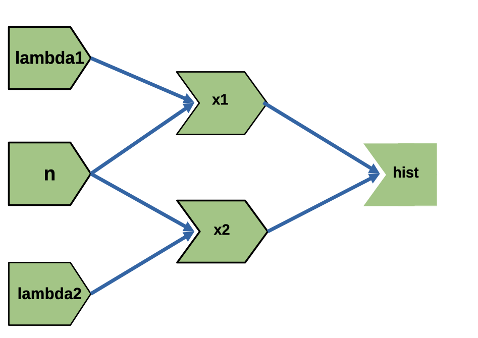

# The reactive graph {#sec-chap14}

## Introduction

```{r}
#| label: setup
#| results: hold
#| include: false

base::source(file = "R/helper.R")
library(glossary)
glossary::glossary_path("../glossary-pb/glossary.yml")
```

:::::: {#obj-chap14}
::::: my-objectives
::: my-objectives-header
Objectives and chapter section list
:::

::: my-objectives-container
The main objective of this chapter is to understand more fully and in
depth the reactive graph.

-   Understanding the reactive graph
-   Importance of invalidation
-   Using the {**reactlog**} package
:::
:::::
::::::

## A step-by-step tour of reactive execution

Instead of the imaginary demo app from the book I will use the app from @lst-03-compare-simulated-data-code3 about the comparison of two distribution with a `r glossary("freqpoly")`.

:::{.column-page-inset}

:::::{.my-r-code}
:::{.my-r-code-header}
:::::: {#cnj-14-two-freqpoly}
: Comparison of two simulated distribution with frequency polygons
::::::
:::
::::{.my-r-code-container}

::: {#lst-14-two-freqpoly}

```{shinylive-r}
#| standalone: true
#| viewerHeight: 550
#| components: [editor, viewer]

## file: app.R

```

Comparison of two simulated distribution with frequency polygons
:::

::::
:::::

:::

Below is a diagram of a reactive graph. The shapes on the left are reactive inputs (or values), the ones in the middle are reactive expressions, and on the right are observers (or outputs). The lines between the shapes are directional, with the arrows indicating the direction of their inter-dependencies. When a shiny app is loaded, this graph is discovered and formed.

{#fig-14-two-freqpoly
fig-alt="alt-text" fig-align="center" 
width="70%"}


::: {#nte-14-my-own-reactlog-tour .callout-note}
###### My own reactlog tour

Using a different app than in the book results in a different `reactlog` tour: I have the following step-by-step tour of reactive executions modified in three ways.

1.  I am using newer and the slightly modified tour guide from the
    description of the {**reactlog**} package.
2.  I am using a useful and real working app to demonstrate the
    different steps. For me a hypothesized app is too abstract and does
    not explain real world reactive execution.
3.  In addition to abstract drawing of the reactive graphs I will use in
    parallel the results of the {**reactlog**} package. To understand
    and interpret a `reactlog` and to interact with {**reactlog**} are
    for me the practical purpose of this chapter[^14-reactive-graph-1].
:::

[^14-reactive-graph-1]: I am using the term in two different ways:
    {**reactlog**} references the package and `reactlog` or just
    reactlog without any emphasis is the result, which shows how the
    reactive graph evolves over time.
    


::: {.callout-caution #cau-14-different-chapter-structure}
###### Different chapter structure

Although I am trying to cover all the content as in the original book chapter about the reactive grap, I will follow a different structure:

- I will follow the step-by-step procedure of [the reactive life cycle](https://rstudio.github.io/reactlog/articles/reactlog.html#reactivity) but with my own example. As I am using not the (nonsensical) demo app of the book I will get distinct steps for my different reactive graph. 
- Additionally I will provide screenshots of these steps via the {**reactlog**} package. I have therefore to explain the usage much earlier than in the book. To understand how each step is represented in the `reactlog`, I have  to cover much more details about the functionality of the {**reactlog**} package.
:::


To explain the process of reactive execution, we’ll use the graphic
shown in @fig-14-reactive-graph. It contains three reactive inputs,
three reactive expressions, and three outputs. Anywhere you see
"output", you can also think "observer." The primary difference is that
certain outputs that aren't visible will never be computed. We'll
discuss the details in @XXX_15_3.

Recall that reactive inputs and expressions are collectively called
`r glossary("reactive producers")`; reactive expressions and outputs are
`r glossary("reactive consumers")`.

{#fig-14-reactive-graph
fig-alt="Input A is connected with reactive expression a, Inputs B and C are connected with reactive expression c. Reactive expression a and Input b are connected with reactive expression b and related to  the outputs 1 and 2. Reactive expression c outputs to output 3."
fig-align="center" width="70%"}

The connections between the components are directional, with the arrows
indicating the direction of reactivity. Shortly, however, you’ll see
that the flow of reactivity is more accurately modelled in the opposite
direction.

The underlying app is not important, but if it helps you to have
something concrete, you could pretend that it was derived from this
not-very-useful app.

:::::::: column-page-inset
::::::: my-r-code
:::: my-r-code-header
::: {#cnj-14-reactivity-demo-app}
: Demo app for the reactivity process example
:::
::::

:::: my-r-code-container
::: {#lst-14-reactivity-demo-app}
```{shinylive-r}
#| standalone: true
#| viewerHeight: 700
#| components: [editor, viewer]

## file: app.R

```

Demo app for the reactivity process example
:::
::::
:::::::
::::::::

::: {#nte-14-skip-reactivity-process .callout-note}
###### Skipping the details of the step-by-step tour of reactivity execution

I will skip the details of the step-by-step tour of reactivity
execution. It seems to me at the moment not important to reproduce every
step here for my notes.
:::

### Exercises

#### Sum-Prod-Division

Draw the reactive graph for the following server function and then
explain why the reactives are not run.

::: {#lst-14-sum-prod-division}
```{r}
#| label: sum-prod-div
#| eval: false

server <- function(input, output, session) {
  sum <- reactive(input$x + input$y + input$z)
  prod <- reactive(input$x * input$y * input$z)
  division <- reactive(prod() / sum())
}
```

Reactive graph with three inputs and three reactives
:::

{#fig-ex-14-1
fig-alt="On the left side three inputs (\"x\", \"y\", and \"z\"), in the middle two reactive expressions (\"sum\" and \"prod\") connected with all inputs. On the right side the reactive expression \"division\" connected with \"sum\" and \"prod\""
fig-align="center" width="70%"}

The server function in @lst-14-sum-prod-division contains only reactive
expression but no output. Therefore the reactives are not run.

## Dynamism

Shiny “forgets” the connections between reactive components that it
spend so much effort recording. This makes Shiny’s reactive dynamic,
because it can change while your app runs.

:::::::: column-page-inset
::::::: my-r-code
:::: my-r-code-header
::: {#cnj-14-dynamism-example}
: Example to demonstrate Shiny’s dynamism
:::
::::

:::: my-r-code-container
::: {#lst-14-dynamism-example}
```{shinylive-r}
#| standalone: true
#| viewerHeight: 500
#| components: [editor, viewer]

## file: app.R

```

Example to demonstrate Shiny’s dynamism
:::
::::
:::::::
::::::::

You might expect the reactive graph to look like
@fig-14-static-reactivity.

{#fig-14-static-reactivity
fig-alt="On the left side are three inputs ('choice', 'a', 'b') that are all three connected to the output 'out'"
fig-align="center" width="50%"}

But because that Shiny dynamically reconstructs the graph after the
output has been invalidated it actually looks like either of the graphs
in @fig-14-dynamic-reactivity, depending on the value of `input$choice`.
This ensures that Shiny does the minimum amount of work when an input is
invalidated. In this, if `input$choice` is set to “b”, then the value of
`input$a` doesn’t affect the `output$out` and there’s no need to
recompute it.

{#fig-14-dynamic-reactivity
fig-alt="The picture consists of two graphics side by side. On the left side its start on the left margin with three inputs ('choice', 'a', and 'b') where only 'choice and 'a' are connected to the output 'out'. The right graphics is almost the same, with the difference that 'choice' and 'b' is connected to 'out'"
fig-align="center" width="80%"}

It’s worth noting (as Yindeng Jiang does in [their
blog](https://shinydata.wordpress.com/2015/02/02/a-few-things-i-learned-about-shiny-and-reactive-programming/))
that a minor change will cause the output to always depend on both a and
b:

::: {#lst-14-reactive-programming}
```{r}
#| label: reactive-programming
#| eval: false

output$out <- renderText({
  a <- input$a
  b <- input$b

  if (input$choice == "a") {
    a
  } else {
    b
  }
}) 
```

A minor change of @lst-14-dynamism-example will cause the output to
always depend on both a and b
:::

This would have no impact on the output of normal R code, but it makes a
difference here because the reactive dependency is established when you
read a value from `input`, not when you use that value.

### The `{reactlog}` package

Drawing the reactive graph by hand is a powerful technique to help you
understand simple apps and build up an accurate mental model of reactive
programming. But it’s painful to do for real apps that have many moving
parts. Wouldn’t it be great if we could automatically draw the graph
using what Shiny knows about it? This is the job of the {**reactlog**}
package, which generates the so called `r glossary("reactlog")` which
shows how the reactive graph evolves over time.

To see the reactlog, you’ll need to first install the reactlog package,
turn it on with `reactlog::reactlog_enable()`, then start your app. You
then have two options:

1.  **Shortcut during runtime**: While the app is running, press
     ( on Windows), to show the
    `reactlog` generated up to that point. (You have to start
    interacting with the app otherwise the keyboard shortcut will not
    open the browser with a new tab and generate the `reactlog`.)
2.  **`shiny::reactlogShow()`**: After app is closed to see the log for
    the complete session.

{**reactlog**} uses the same graphical conventions as this chapter, so
it should feel instantly familiar. The biggest difference is that
{**reactlog**} draws every dependency, even if it’s not currently used,
in order to keep the automated layout stable. Connections that are not
currently active (but were in the past or will be in the future) are
drawn as thin dotted lines.

{#fig-14-reactlog-demo
fig-alt="alt-text" fig-align="center" width="100%"}

@fig-14-reactlog-demo shows the reactive graph that {**reactlog**} draws
for the app we used above. There’s a surprise in this screenshot: there
are three additional reactive inputs (`clientData$output_x_height`,
`clientData$output_x_width`, and `clientData$pixelratio`) that don’t
appear in the source code. These reactives exist because plots have an
implicit dependency on the size of the output; whenever the output
changes size the plot needs to be redrawn.

Note that while reactive inputs and outputs have names, reactive
expressions and observers do not, so they’re labelled with their
contents. To make things easier to understand you may want use the
`label` argument to `reactive()` and `observe()`, which will then appear
in the reactlog. You can use emojis to make particularly important
reactives stand out visually.

## Glossary Entries {#unnumbered}

```{r}
#| label: glossary-table
#| echo: false

glossary_table()
```

------------------------------------------------------------------------

## Session Info {.unnumbered}

::::: my-r-code
::: my-r-code-header
Session Info
:::

::: my-r-code-container
```{r}
#| label: session-info

sessioninfo::session_info()
```
:::
:::::
